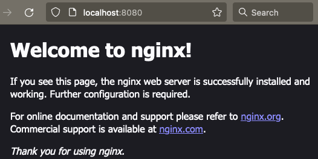

# k8s on Docker with local registry

To spin up a local registry (at localhost:5001) and 2 node kubernets cluster, 
Run the provided bash script
```
./create_cluster.sh
```

NOTE: Feel free to tweak the KinD cluster configs inside the bash script e.g. add mode worker nodes, 
set worker node configs etc.

Once deployed, each kubernets node will now be running as docker container. List containers;

```commandline
% docker ps
CONTAINER ID   IMAGE                  COMMAND                  CREATED          STATUS          PORTS                                                 NAMES
14135f5e057f   kindest/node:v1.24.0   "/usr/local/bin/entr…"   25 minutes ago   Up 25 minutes                                                         kind-worker
65a7a6131549   kindest/node:v1.24.0   "/usr/local/bin/entr…"   25 minutes ago   Up 25 minutes   127.0.0.1:64069->6443/tcp, 0.0.0.0:30070->30080/tcp   kind-control-plane
397843f0e9fe   registry:2             "/entrypoint.sh /etc…"   25 minutes ago   Up 25 minutes   127.0.0.1:5001->5000/tcp                              registry
```

### Test local registry

Try to push any docker image into the local docker registry. Either create your own from Dockerfile, or in our case, 
we download a publically available image `nginx`. 

```commandline
> docker pull nginx
Status: Downloaded newer image for nginx:latest
docker.io/library/nginx:latest
```

Tag this image by changing the registry host to `localhost:5001`
```commandline
docker tag docker.io/library/nginx:latest localhost:5001/nginx
```

Now push the image to local registry
```commandline
> k8s_kind_docker % docker push localhost:5001/nginx
Using default tag: latest
The push refers to repository [localhost:5001/nginx]
4280bf75d59a: Pushed 
a15f6df32c16: Pushed 
260571b9b9ec: Pushed 
7b795f132dec: Pushed 
bae3e6fa3b43: Pushed 
21ec097e7be7: Pushed 
latest: digest: sha256:91d5b6827ff7f88e56ecac8e8ab9fa19e3f821b79e577a82d40ce613312dea8b size: 1570
```

the above output logs shows the image has been pushed to local registry successfully. But just to double check, 
we can now try pulling from local registry. 

```commandline
// first delete from docker images
docker rmi localhost:5001/nginx

// now pull from local registry
docker pull localhost:5001/nginx
```

## Deploy Hello-World app

We can now test deploying a simple nginx application;

```commandline
kubectl create -f hello-world-app/
```
wait for pod to start. List pods and see its its ready
```commandline
> jagex % kubectl get pods
NAME                     READY   STATUS    RESTARTS   AGE
nginx-67798974c9-h2rvw   1/1     Running   0          32m
```

After pod is in `Running` state, we can now port-forward the service and access it via browser
```commandline
kubectl port-forward service/ngnix-service 8080:80
```
If everything works fine, you should see this in browser when access http://localhost:8080



#### Using different image ?   
If you are using different image, be sure to change that in deployment manifest yaml file
```yaml
    spec:
      containers:
      - name: nginx
        image: localhost:5001/nginx   <--- here
        ports:
        - containerPort: 80
```

## Cleanup

To destroy kind cluster
```commandline
// kind delete cluster --name=<cluster_name>
kind delete cluster --name=kind
```

Be sure to delete the local registry container too
```commandline
docker stop registry
docker rm registry 
```

Happy Kuberneting!


